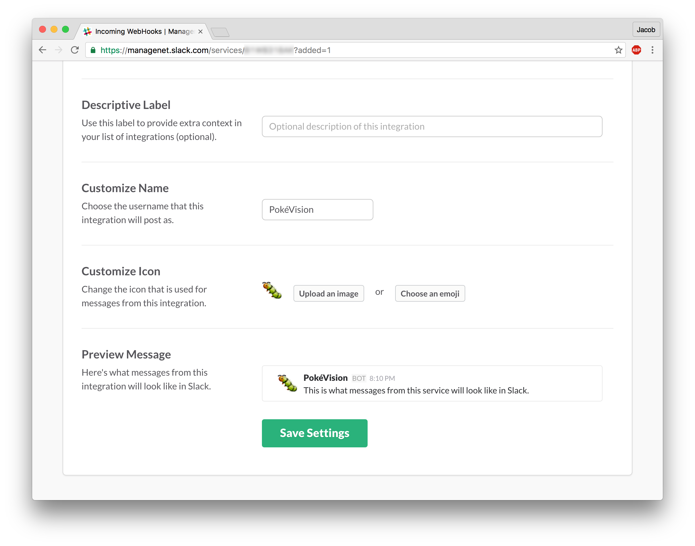

# Slack notifications

Go to your organisation's Apps & Integrations page. It should look like this;


Click on the "Build" button in the top right hand corner, then choose "Make a Custom Integration", and finally select "Incoming WebHooks".

Choose the default channel you wish PokéVision CLI to push to. Don't worry, this can be overridden through the command line.

Once you've created the WebHook, you should be on a page which presents you with a Webhook URL, make sure to take note of this.

At the bottom of the page, you can change the name of the bot (I've changed it to "PokéVision"). Changing the icon has no affect as it's overridden with the Pokémon's icon.



Now let's tell the CLI to push notifications to Slack.

To enable Slack notifications, the `--slack` flag is passed.

To tell the CLI where to push the notifications, we pass the Webhook URL from before, into the `--slack-wehbook-url` flag.

And optionally, if you wish to post to a different channel, you can pass the name of that channel to the `--slack-channel` flag.

Together, the command you run should look something like this...

```sh
pokevision watch \
  --forever \
  --lat=40.712774 \
  --lon=-74.013408 \
  --name="World Trade Center" \
  --slack \
  --slack-webhook-url="https://hooks.slack.com/services/T12345678/B12345678/nfogsnfmwi34oti3g4ot8" \
  --slack-channel=random
```

And bam! You should see your Slack notifications coming through!


